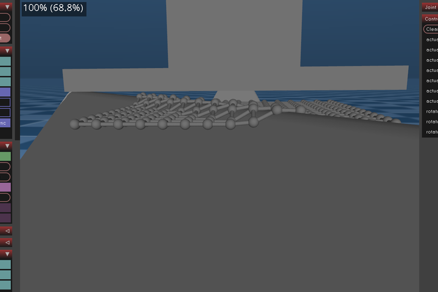

# Tactile 3D Exploration and Perception Project


## Contents
1. `arduino_readout` contains the Arduino readout scheme for event-based tactile sensors
2. `CAD` and `mesh` contain the AutoDesk Inventor design and `stl` mesh files of objects and mechanical components
3. `tacsense` contains the notebooks for tactile encoding in MuJoCo
4. [SpikyMotion](https://github.com/wngfra/SpikyMotion) contains the ROS2 server to control the real robot (Franka Emika Panda)
5. `tactile_sensor` contains the KiCAD project of the sensor design
6. `loihi` contains the demos for Loihi KapohoBay

## Notes
* Intel Lohi KapohoBay support(beta) is provided in the container, copy NxSDK tarballs to [docker](./loihi/docker/) directory, bring up the container in [loihi](./loihi/) with
  ```bash
    sudo rmmod ftdi_sio # Remove FTDI interfaces from kernel
    docker-compose up loihi
  ```
## TODO
1. Extract shape function with bivariate Generalized-Gaussian Spatial Model (GGSM)
2. Estimate the parameters of GGSM
