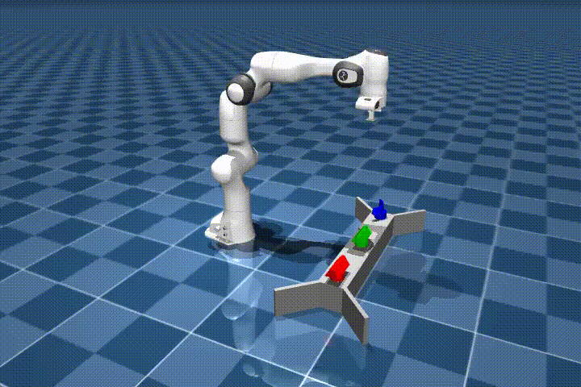

# Tactile 3D Exploration


1. [CAD](CAD/) contains the CAD files (AutoDesk Inventor).
2. [demos](demos/) contains demos of tactile memory and exploration with spatial semantic pointer (SSP).
3. [tac3d](tac3d/) contains the [ROS2](https://docs.ros.org/en/humble/index.html) packages for active tactile exploration simulation.

## Features
- Intel Loihi support via docker
- Online simulation in [MuJoCo](https://mujoco.org/) with [ROS2](https://www.ros.org/) interfaces
- Asynchronous neural simulation in [Nengo](https://www.nengo.ai/)

## Loihi
1. Copy NxSDK tarballs to [loihi](loihi/) directory, setup the kernel before running the container
  ```bash
    sudo rmmod ftdi_sio # Remove FTDI interfaces from kernel
  ```
2. Launch the active exploration simulation in the docker container
  ```bash
    cd loihi
    docker compose up
  ```
## Reference
[1] Komer, B., Stewart, T. C., Voelker, A. R., & Eliasmith, C. (2019). A neural representation of continuous space using fractional binding. Proceedings of the 41st Annual Meeting of the Cognitive Science Society. Annual Meeting of the Cognitive Science Society, Montreal, QC, Canada.

[2] Voelker, A. R., Blouw, P., Choo, X., Dumont, N. S.-Y., Stewart, T. C., & Eliasmith, C. (2021). Simulating and Predicting Dynamical Systems With Spatial Semantic Pointers. Neural Computation, 33(8), 2033–2067. https://doi.org/10.1162/neco_a_01410

[3] Still, S., & Precup, D. (2012). An information-theoretic approach to curiosity-driven reinforcement learning. Theory in Biosciences, 131(3), 139–148. https://doi.org/10.1007/s12064-011-0142-z