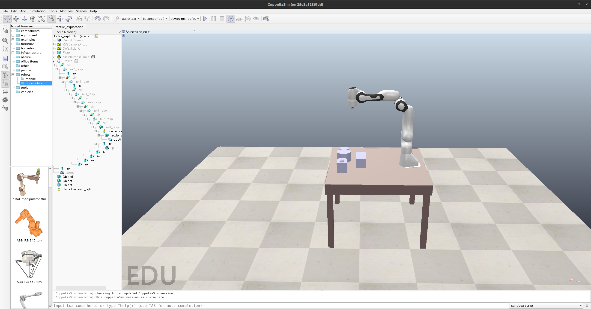

# Tactile 3D Exploration and Perception Project

## Contents
1. `arduino_readout` contains the Arduino readout scheme for event-based tactile sensors
2. `CAD` and `mesh` contain the AutoDesk Inventor design and `stl` mesh files of objects and mechanical components
3. `explore_control` contains the ROS2 control client for tactile exploration (for both simulation and robot)
4. `scenes` and `scripts` are the CoppeliaSim scenes and the scripts to run in the docker container
5. `sensor_interfaces` contains ROS2 interface to fetch the sensory signals (for both simulation and sensors) and signal encoders
6. [SpikyMotion](https://github.com/wngfra/SpikyMotion) contains the ROS2 server to control the real robot (Franka Emika Panda)
7. `tactile_sensor` contains the KiCAD project of the sensor design

## Quick Guide
* Build a specific package (otherwise all packages will be rebuilt, it takes ages) inside the container with
  ```bash
  cd /workspace # if you are not there
  colcon build --packages-select <package-name> --symlink-install
  . install/setup.bash # source the environment
  ```
  Boom! You are ready to go.
* Remember to run `docker-compose down` when you are done to remove the shitty containers!
### Simulation
* Run `xhost + && docker-compose up` in the repo root directory to launch CoppeliaSim in the docker container with the prebuilt image [ros2cuda:coppeliasim](https://hub.docker.com/r/wngfra/ros2cuda/tags).
    * [nvidia-docker](https://github.com/NVIDIA/nvidia-docker) and `CUDA-11.7` needed
* Custom message and service types need to be inserted in [scripts/interfaces.txt](./scripts/interfaces.txt) and they will be compiled after the container is launched.
* If you need to add custom packages for `sim_ros2_interfaces`, remember to modify [CMakeLists.txt](./scripts/CMakeLists.txt) and [package.xml](./scripts/package.xml) correspondingly, they will be copied to the `sim_ros2_interfaces` root directory for `colcon` compilation.
* Check [CoppeliaSim Manual](https://www.coppeliarobotics.com/helpFiles/index.html) for details.
* Default physics engine is set to [MuJoCo](https://mujoco.org/).
### Perception and Learning
* Cross-container communication without exposing `host` network is enabled by [fastrtps-profile.xml](./scripts/fastrtps-profile.xml) (to avoid security risks).
* Launch a new terminal in the existing container with
  ```bash
  docker exec -it tac3d_ml_<id> bash
  ```
  Then start the simulation and run
  ```bash
  . install/setup.bash
  ros2 launch explore_control explore_launch
  ```
  Happy exploring!
* Check detailed [ROS2 Tutorials](https://docs.ros.org/en/humble/Tutorials.html).

## Notes
* Intel Lohi support(beta) is provided by [docker/Dockerfile](./docker/Dockerfile), copy NxSDK tarballs to [docker](./docker/) directory, bring up the container with
  ```bash
    sudo rmmod ftdi_sio # Remove FTDI interfaces from kernel
    docker-compose up loihi
  ```